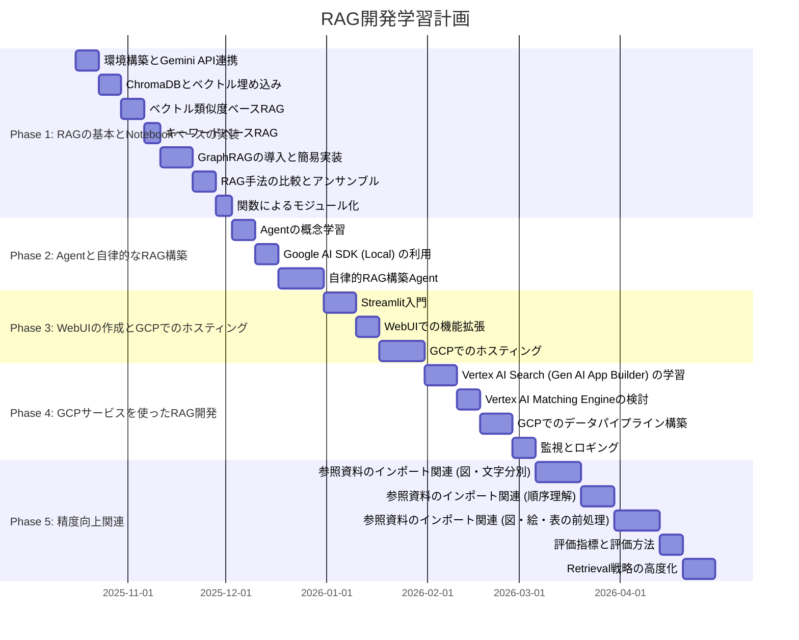

# 251012_dev
開発中

## env
python 3.11.7
### 仮想環境
```cmd
py -3.11 -m venv .venv
```


---

## フォルダ構成

```
251012_dev.git\
├───.gemini/
│   ├───geminicli.txt
│   └───rules.md
├───.git/
├───.venv/
├───src/
│   ├───agents/
│   │   └───def agents.txt
│   ├───data_processing/
│   │   └───ドキュメントのロード_前処理_チャンク化など.txt
│   ├───generators/
│   │   └───LLMに回答を生成させる機能.txt
│   ├───pipelines/
│   │   └───RAGの各処理を繋ぐパイプライン.txt
│   ├───retrievers/
│   │   └───ベクトル検索やキーワード検索などの検索機能.txt
│   ├───tool/
│   │   └───defs.txt
│   └───web_ui/
│       └───StreamlitなどのUI関連コード.txt
├───notebooks/
│   └───実験や分析用のJupyter_Notebook.txt
├───data/
│   ├───raw/
│   │   └───未加工の参照ドキュメント.txt
│   ├───processed/
│   │   └───処理済みのデータ.txt
│   └───vector_store/
│       └───ChromaDBなどのローカルDB.txt
├───tests/
│   └───テストコード.txt
├───configs/
│   ├───.env.sample
│   └───設定ファイル.txt
├───scripts/
│   └───データ取得やバッチ処理などの補助スクリプト.txt
└───docs/
    └───プロジェクト関連ドキュメント.txt
```


---


# RAG開発学習計画

## 概要

本学習計画は、RAG（Retrieval Augmented Generation）の開発を学ぶためのロードマップです。GitHubでコードを管理し、主にGoogle Gemini APIとローカルPCでの実行を想定しています。最終的には、様々なRAG手法を理解し、WebUIでの実装、さらにはGCPサービス連携までを目指します。

## 学習目標

*   多様なRAG手法（ベクトル類似度、キーワードベース、GraphRAGなど）の理解と実装
*   Agentによる自律的なRAG構築の習得
*   Streamlitを用いたWebUIの開発とGCPでのホスティング
*   GCPサービスを活用したRAG開発
*   RAGの精度向上技術（参照資料の処理、マルチモーダル対応など）の習得

## 使用技術スタック

*   **LLM API:** Google Gemini API
*   **ベクトルデータベース:** ChromaDB (初期)
*   **フレームワーク:** LangChain, LlamaIndex (適宜導入)
*   **プログラミング言語:** Python
*   **バージョン管理:** Git, GitHub
*   **Webフレームワーク:** Streamlit
*   **クラウドプラットフォーム:** Google Cloud Platform (GCP)
*   **その他:** Google AI SDK

## 学習ロードマップ

### Phase 1: RAGの基本とNotebookベースの実装

このフェーズでは、RAGの基本的な概念を理解し、Jupyter Notebookベースで様々なRAG手法を実装します。各手法の比較とアンサンブルに重点を置きます。

**目標:**
*   ChromaDBを用いたベクトル類似度ベースRAGの実装
*   キーワードベースRAGの実装
*   GraphRAGの概念理解と簡易的な実装
*   上記3種類の比較とアンサンブルの実現
*   データベース、リトリーバー、生成を関数で分離したコード構造の理解

**具体的な学習内容:**

1.  **環境構築とGemini API連携:**
    *   Python環境（仮想環境）構築
    *   Google Gemini APIキーの取得と設定
    *   簡単なAPI呼び出しテスト
2.  **ChromaDBとベクトル埋め込み:**
    *   テキストデータのロードとチャンク化
    *   Gemini APIを用いたテキストの埋め込みベクトル生成
    *   ChromaDBへのベクトルデータの保存と検索
3.  **ベクトル類似度ベースRAG:**
    *   ユーザーの質問から関連ドキュメントを検索し、LLMに渡して回答を生成する一連の流れを実装
    *   LangChainやLlamaIndexの基本的な使い方を学ぶ
4.  **キーワードベースRAG:**
    *   BM25などのキーワードベース検索手法の導入
    *   ベクトル類似度ベースRAGとの比較
5.  **GraphRAGの導入 (概念理解と簡易実装):**
    *   知識グラフの構築方法の学習（既存データからの抽出、LLMを用いた生成など）
    *   グラフ構造を利用した情報検索の基本
    *   簡易的なGraphRAGの実装
6.  **RAG手法の比較とアンサンブル:**
    *   各RAG手法のメリット・デメリットを評価
    *   複数のリトリーバーの結果を組み合わせるアンサンブル手法を試す（e.g., Re-ranking, Fusion）
7.  **関数によるモジュール化:**
    *   データロード、ベクトル化、DB保存、リトリーブ、生成の各プロセスを関数に分離し、保守性の高いコードを作成

**成果物:**
*   各RAG手法を実装したJupyter Notebook
*   複数のRAG手法を比較検討した結果レポート
*   アンサンブルRAGの実装例

### Phase 2: Agentと自律的なRAG構築

このフェーズでは、Agentの概念を導入し、複数のRAGを自律的に作り分ける方法を学習します。

**目標:**
*   Agentの基本的な仕組みを理解する
*   Google AI SDKをローカルで利用し、Agentを構築する
*   Agentが質問に応じて最適なRAG戦略を選択・実行できるようにする

**具体的な学習内容:**

1.  **Agentの概念学習:**
    *   LLMを推論エンジンとしたツール利用、計画立案、記憶などの概念を理解
    *   LangChain AgentsやLlamaIndex Agentsの利用方法を学ぶ
2.  **Google AI SDK (Local) の利用:**
    *   `google-generative-ai`ライブラリを用いたAgent構築の基礎
    *   カスタムツール（RAG機能など）をAgentに与える方法
3.  **自律的RAG構築Agent:**
    *   Agentが質問の内容を分析し、最適なRAG手法（ベクトル、キーワード、GraphRAGなど）を選択するロジックを実装
    *   複数のRAGシステムをツールとしてAgentに与え、状況に応じて使い分けさせる
    *   特定のタスクに特化したRAGシステムをAgentが動的に構築・利用する仕組みを検討

**成果物:**
*   質問内容に応じて最適なRAG手法を選択・実行するAgentの実装

### Phase 3: WebUIの作成とGCPでのホスティング

開発したRAGシステムをユーザーフレンドリーなWebアプリケーションとして公開することを目指します。

**目標:**
*   Streamlitを用いたRAGアプリケーションのWebUI化
*   GCPでのアプリケーションデプロイとホスティング

**具体的な学習内容:**

1.  **Streamlit入門:**
    *   Streamlitの基本的なUIコンポーネントとレイアウト
    *   RAGシステムのバックエンドとStreamlitフロントエンドの連携
    *   ユーザー入力（質問）の受け取り、RAG処理の実行、結果表示
2.  **WebUIでの機能拡張:**
    *   RAG手法の選択機能
    *   参照ドキュメントの表示
    *   履歴機能の追加
3.  **GCPでのホスティング:**
    *   Google Cloud RunやApp Engineなどのサービスを検討
    *   Dockerを用いたコンテナ化の学習
    *   デプロイメントパイプラインの構築
    *   APIキーなどの秘匿情報の安全な管理（Secret Managerなど）

**成果物:**
*   Streamlitで構築されたRAG Webアプリケーション
*   GCP上にデプロイされ、アクセス可能なRAG Webアプリケーション

### Phase 4: GCPサービスを使ったRAG開発

GCPが提供するマネージドサービスを活用して、RAGシステムの堅牢性、スケーラビリティ、運用性を向上させます。

**目標:**
*   Vertex AI Search (旧Gen AI App Builder) やMatching EngineなどのGCPサービスへの理解
*   GCPサービスをRAGパイプラインに組み込む

**具体的な学習内容:**

1.  **Vertex AI Search (旧Gen AI App Builder) の学習:**
    *   ドキュメントの取り込みとインデックス作成
    *   エンタープライズ検索アプリケーションの構築
    *   Geminiモデルとの連携
2.  **Vertex AI Matching Engine:**
    *   高精度なベクトル検索サービスとしての利用
    *   ChromaDBからMatching Engineへの移行検討
3.  **データパイプラインの構築 (GCP):**
    *   Cloud Storageを用いたデータ管理
    *   Cloud FunctionsやCloud Workflowsを用いた自動化
4.  **監視とロギング:**
    *   Cloud Monitoring, Cloud Loggingを用いたシステムの監視とデバッグ

**成果物:**
*   GCPサービスを一部または全体に組み込んだRAGシステム

### Phase 5: 精度向上関連

RAGの回答精度を向上させるための技術と、参照資料の柔軟な処理方法を学習します。

**目標:**
*   参照資料の品質向上と前処理技術の習得
*   マルチモーダルな入力への対応
*   RAGシステムの評価方法の理解

**具体的な学習内容:**

1.  **参照資料のインポート関連:**
    *   **図や文字の自動分別と適切な処理:**
        *   OCR技術 (Document AIなど) の活用
        *   画像からテキスト、テキストから画像の説明を生成する技術
        *   マルチモーダルLLMの活用 (Geminiのマルチモーダル機能)
    *   **順序の理解:**
        *   文書構造を維持したチャンク分割戦略
        *   参照ドキュメント間の関係性をLLMに伝えるプロンプトエンジニアリング
        *   グラフ構造による文書関係の表現
    *   **図、絵、表の前処理:**
        *   表データの構造化（CSV, JSONなど）
        *   画像の内容説明（キャプション生成）
        *   図中のテキスト抽出と文脈への組み込み
2.  **評価指標と評価方法:**
    *   RAGシステムの評価指標（Recall, Precision, Faithfulnessなど）の学習
    *   人間による評価 (Human-in-the-Loop) の導入
    *   自動評価ツールの利用 (Ragasなど)
3.  **Retrieval戦略の高度化:**
    *   ハイブリッド検索 (キーワード + ベクトル) の洗練
    *   リランキングアルゴリズムの導入 (ColBERT, Cohere Rerankなど)
    *   自己改善型RAG (Self-RAG, Corrective RAG) の概念学習

**成果物:**
*   マルチモーダルデータに対応したRAGの概念実装
*   RAGシステムの評価フレームワークの構築

---

## スケジュール感 (Mermaid ガントチャート)

---

## 勉強の進め方

### 1. ペアプログラミングとコードレビュー

*   週に数回、オンラインまたはオフラインで時間を合わせ、一緒にコードを書きましょう。
*   一人がドライバー、もう一人がナビゲーターとなり、役割を交代しながら進めます。
*   書いたコードはGitHubのプルリクエスト機能を使って互いにレビューし、改善点や疑問点を共有しましょう。

### 2. 情報を共有し、議論する

*   新しい技術や論文を見つけたら、積極的に共有し、その内容について議論しましょう。
*   詰まった点や分からない点があれば、すぐに相談し、二人で解決策を探しましょう。

### 3. 小さな成功体験を積み重ねる

*   一度に大きな目標を達成しようとせず、各フェーズ、各タスクで小さな目標を設定し、達成する喜びを味わいながら進めましょう。
*   動作するプロトタイプを早めに作り、そこから徐々に機能を拡張していくアプローチが効果的です。

### 4. ドキュメンテーションを重視する

*   GitHubのREADMEやWikiを活用し、学習したこと、実装の工夫、詰まった点とその解決策などを記録していきましょう。
*   コードだけでなく、設計思想や検討過程も残すことで、後から振り返りやすくなります。
